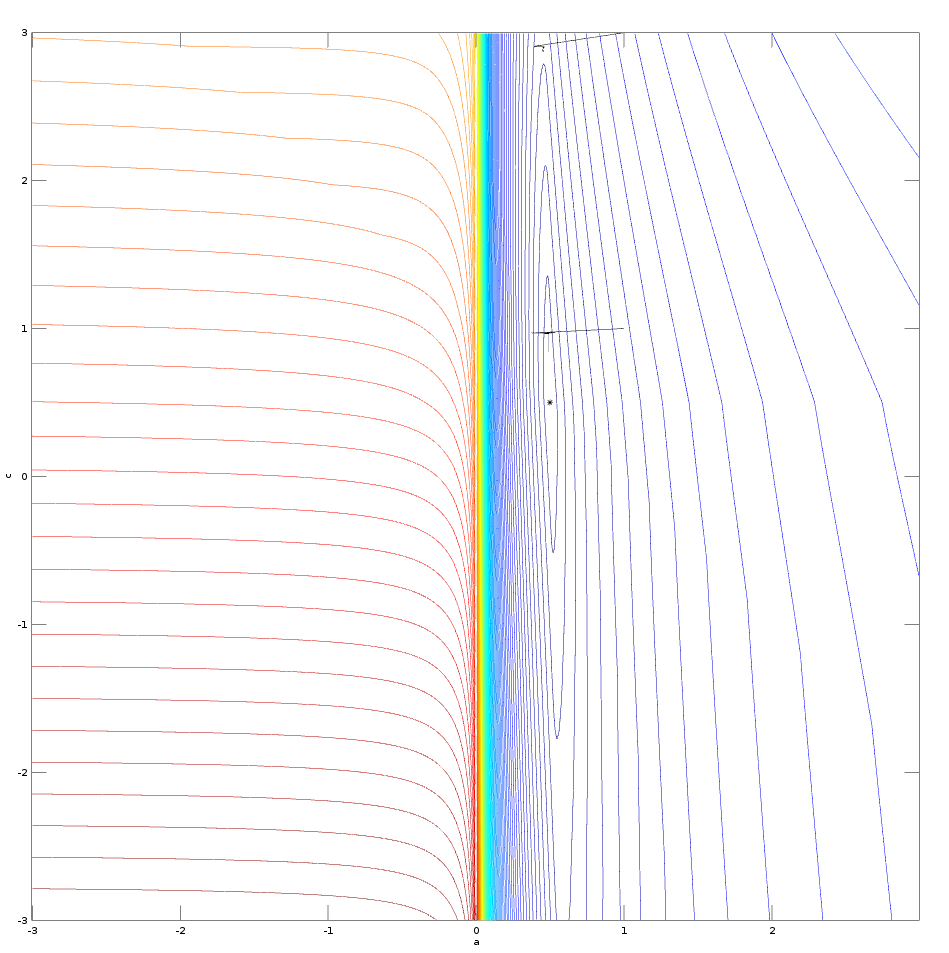
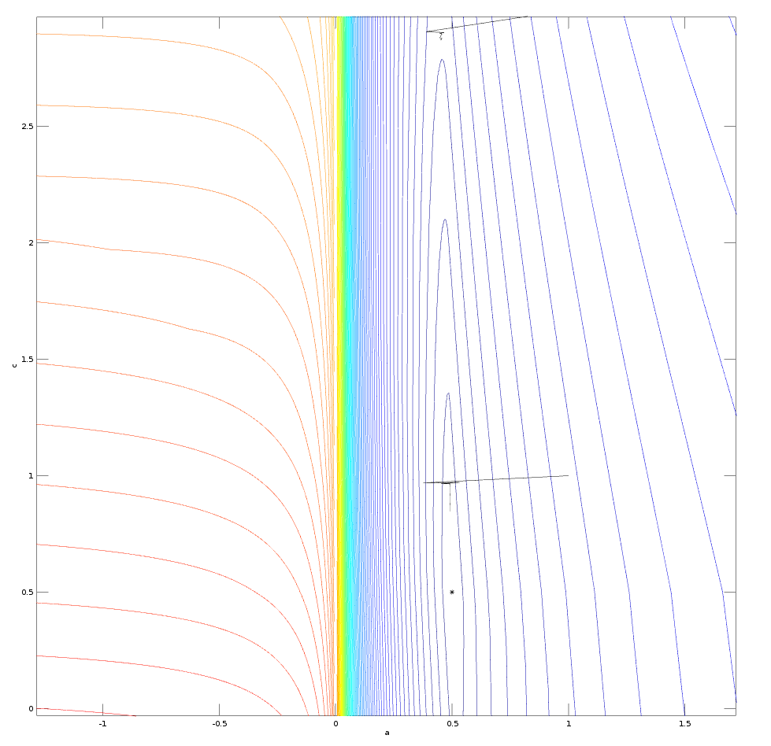
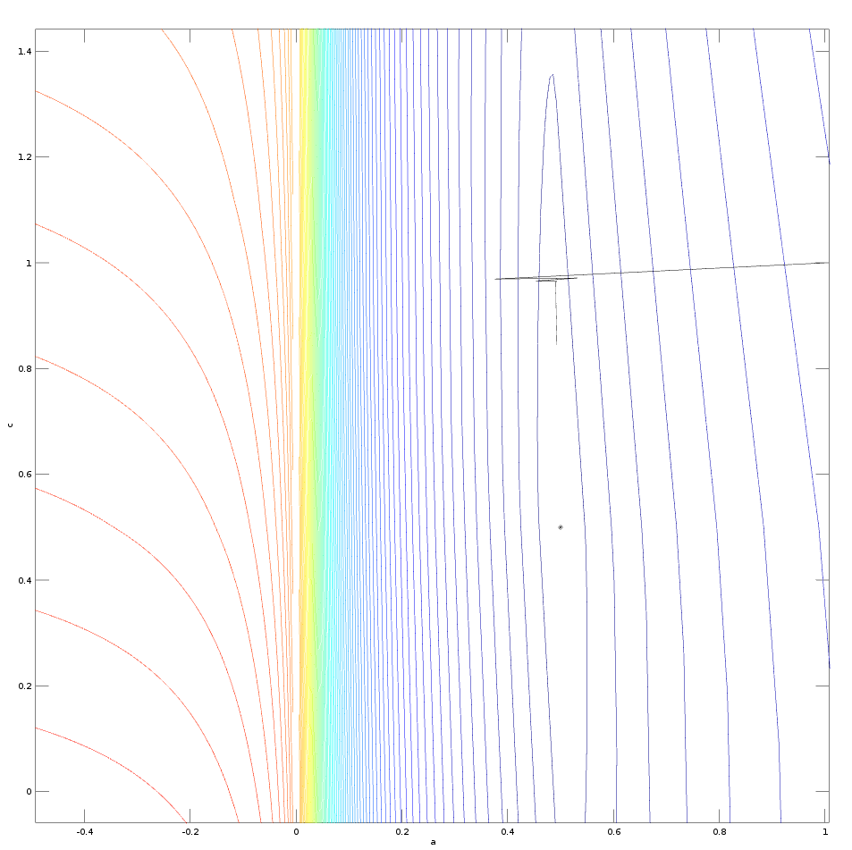

# dumb-gradient-descender
A dumb gradient descender.

I was looking for a minimizer with the following property: **simple to remember and so simple to code from scratch**.

I found interesting ideas in [*Lecture Notes: Some notes on gradient descent* by Marc Toussaint](https://ipvs.informatik.uni-stuttgart.de/mlr/marc/notes/gradientDescent.pdf), in [*Introduction to
Optimization, Gradient-based Methods* by the same author](https://ipvs.informatik.uni-stuttgart.de/mlr/marc/teaching/13-Optimization/02-gradientMethods.pdf) and in [*CS168: The Modern Algorithmic Toolbox Lecture #15: Gradient Descent Basics* by Tim Roughgarden & Gregory Valiant](http://web.stanford.edu/class/cs168/l/l15.pdf).

Unfortunately the minimizer I coded does not find the minimum, in the following figure the minimum is at (.5,.5) and there are two starting point at (1,3) and (1,1):

A zoomed-in figure:

and a close-up for the starting point at (1,1):

.

I do not known if the minimizer fails because it has some bugs or for some different causes, anyway an important lesson is: **when you need to minimize a non convex function, with a simple gradient descent algorithm, the initial estimate for the variable is of paramount importance**.

